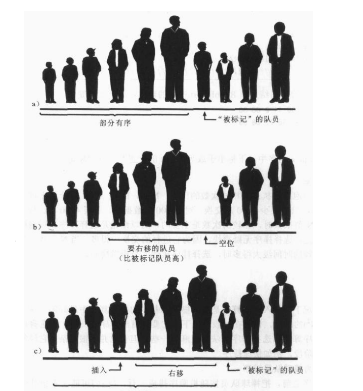
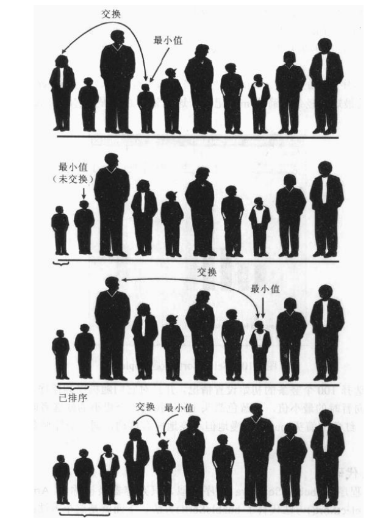
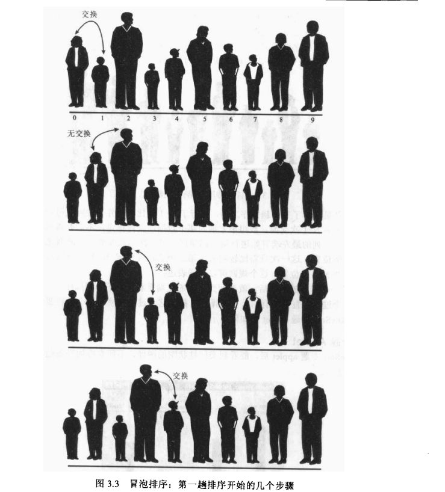
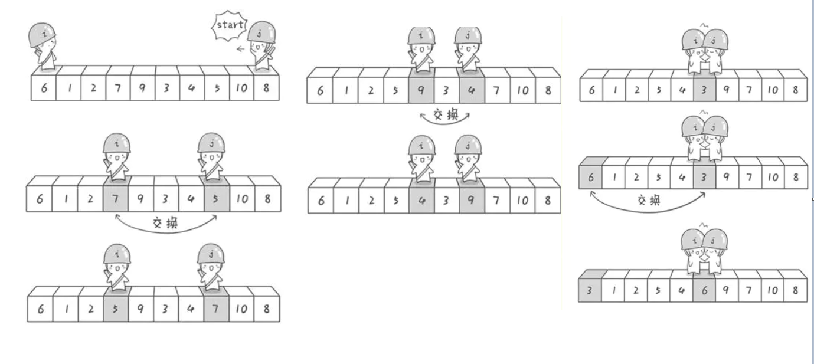

# 简单排序
## 1、插入排序
``默认观察元素前面为有序的，不断的去跟前面的元素做比较，比较的同时不断的把元素后移动，
直到找到一个元素比观察元素小则停止，把观察元素放到此位置``


## 2.选择排序
``选择排序每次选择数组里面最小的一个排到前面。算法思想，先假设第一个为整个队列中最小的，然后观察这个元素后面的元素，进行比较
 如果比他小，就做交换。之后再观察``


## 3.冒泡排序
``观察相邻的元素，如果前一个元素大，进行交换，不停的进行比较，只到比较到队列中的最后一个元素``


# 高级排序
## 1. 快速排序
``选择观察元素，然后从下表r从右边往左进行查找第一个比较观察元素小的元素，从下标l左往右找第一个比观察元素大的位置，两两进行交换，不停的查找
一直查找到l=r,记录此位置，将观察元素跟这个位置的元素进行交换。然后切分两个数组，进行递归调用排序``


## 2.希尔排序
````
